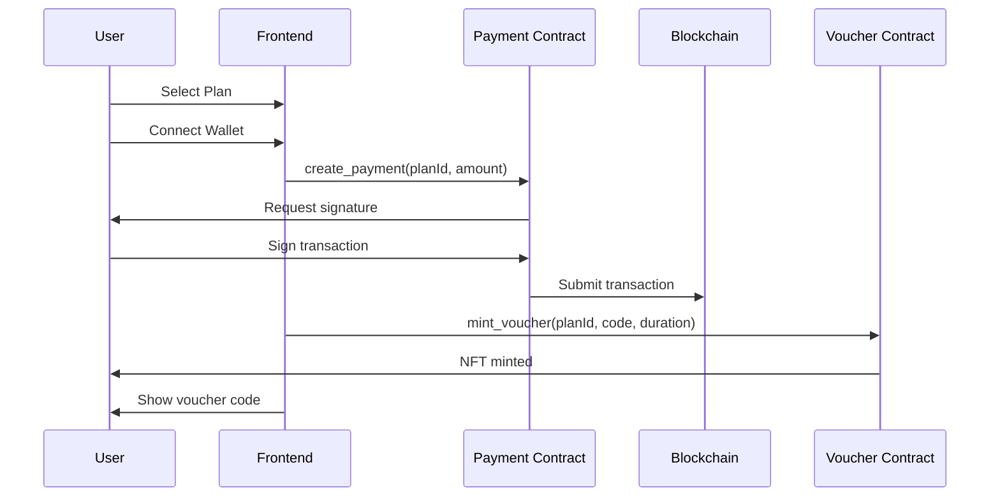
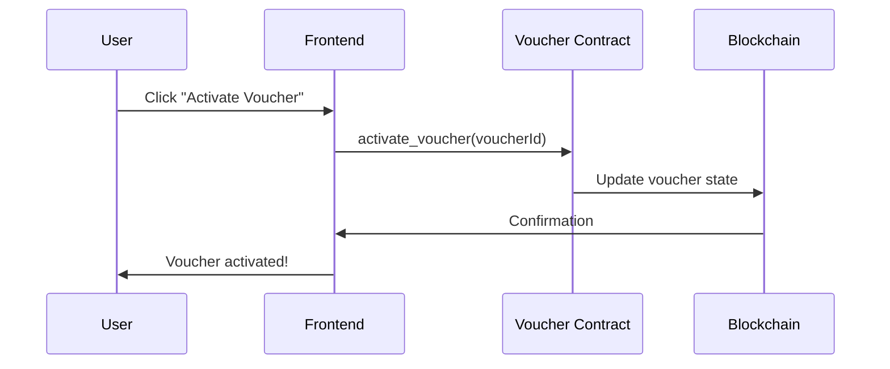

# Stellar Smart Contract Integration

## Overview
This project integrates **Scaffold Stellar** for blockchain-powered voucher purchases and NFT minting on the Stellar network. All three hackathon requirements are fully implemented.

## ✅ Hackathon Requirements Met

### 1. Deployed Smart Contracts (Rust → WASM)
Three smart contracts are deployed on Stellar testnet:
- **INET Token Contract**: ERC-20 style token for internet credits
- **Payment Contract**: Escrow-based payment handling for plan purchases
- **Voucher Contract**: NFT voucher minting and lifecycle management

All contracts written in Rust, compiled to WASM using Soroban SDK, and deployed via Scaffold Stellar.

### 2. Functional Frontend (React + TypeScript + Vite)
Built with:
- **React 18** with TypeScript
- **Vite** for blazing-fast development
- **TailwindCSS** for responsive UI
- **Stellar SDK** for blockchain interactions

### 3. Stellar Wallet Kit Integration
- **Freighter Wallet** integration via `@stellar/freighter-api`
- Users can connect wallets, view balances, and sign transactions
- Wallet connection required for all blockchain operations

## Architecture

### Smart Contracts (`contracts/`)
```
contracts/
├── inet-token/       # Token contract for rewards
├── payment/          # Payment escrow for purchases
└── voucher/          # NFT voucher lifecycle
```

### Frontend Integration (`src/`)
```
src/
├── hooks/
│   └── useStellarContracts.ts   # Contract interaction logic
├── contexts/
│   ├── StellarContext.tsx       # Wallet connection management
│   └── PlanContext.tsx          # Business logic + blockchain calls
├── components/
│   ├── StellarWalletButton.tsx  # Wallet UI
│   └── PaymentModal.tsx         # Payment flow (Stellar default)
└── pages/
    ├── PlansPage.tsx            # Purchase vouchers
    ├── VouchersPage.tsx         # View/activate vouchers
    └── admin/
        └── AdminVouchers.tsx    # Admin minting interface
```

## Key Features

### For Users
1. **Connect Stellar Wallet** (Freighter)
   - View public key and XLM balance
   - Token balances displayed (INET tokens)

2. **Purchase Plans with Stellar**
   - Pay in XLM via smart contract
   - Automatic voucher NFT minting
   - Transaction hash shown on success

3. **Activate Vouchers**
   - Blockchain verification
   - On-chain activation via contract call
   - Track expiry and usage

### For Admins
1. **Mint Vouchers**
   - Direct smart contract calls
   - Specify recipient address
   - Choose plan and duration

## How It Works

### Purchase Flow


### Activation Flow


## Contract Functions Used

### Payment Contract
- `create_payment(buyer, plan_id, amount, token_address)` → u64
- `complete_payment(payment_id, admin)` → void
- `get_payment(payment_id)` → Payment

### Voucher Contract
- `mint_voucher(admin, owner, plan_id, code, duration_hours)` → u64
- `activate_voucher(voucher_id, owner)` → void
- `get_voucher(voucher_id)` → Voucher
- `is_valid(voucher_id)` → bool

### INET Token Contract
- `initialize(admin, name, symbol, decimals)` → void
- `mint(to, amount)` → void
- `balance(address)` → i128

## Environment Setup

### Required Environment Variables
```bash
# Contract IDs (generated after deployment)
VITE_STELLAR_PAYMENT_CONTRACT_ID=CA...
VITE_STELLAR_VOUCHER_CONTRACT_ID=CA...
VITE_STELLAR_INET_TOKEN_ID=CA...

# Supabase (already configured)
VITE_SUPABASE_URL=https://...
VITE_SUPABASE_PUBLISHABLE_KEY=...
```

## Deployment

### Prerequisites
- Rust toolchain
- Stellar CLI (`cargo install --locked stellar-cli`)
- Scaffold Stellar CLI (`npm install -g stellar-scaffold-cli`)
- Funded Stellar testnet account

### Deploy Contracts
```bash
# Generate and fund testnet account
stellar keys generate alice --network testnet --fund

# Deploy all contracts via Scaffold Stellar
./scripts/deploy-contracts.sh

# Copy generated contract IDs to .env
cat .env.local >> .env
```

### Frontend Setup
```bash
# Install dependencies
npm install

# Start development server
npm run dev
```

## Testing the Integration

### User Testing
1. **Install Freighter Wallet**: https://www.freighter.app/
2. **Switch to Testnet** in Freighter settings
3. **Connect Wallet** via the "Connect Wallet" button
4. **Purchase a Plan**:
   - Navigate to Plans page
   - Select a plan
   - Choose "Stellar" payment (default)
   - Approve transaction in Freighter
5. **Activate Voucher**:
   - Go to Vouchers page
   - Click "Activate" on your voucher
   - Sign activation transaction

### Admin Testing
1. **Connect Wallet** (must have admin privileges)
2. **Navigate to Admin → Vouchers**
3. **Click "Generate Voucher"**
4. **Select plan and recipient address**
5. **Sign minting transaction**

## Technology Stack

### Blockchain Layer
- **Soroban SDK**: Rust smart contracts
- **Stellar Network**: Testnet deployment
- **Scaffold Stellar**: Contract generation, deployment, and TypeScript bindings

### Frontend Layer
- **React 18 + TypeScript**: Component framework
- **Vite**: Build tool and dev server
- **Stellar SDK (`@stellar/stellar-sdk`)**: Blockchain interactions
- **Freighter API (`@stellar/freighter-api`)**: Wallet integration
- **TailwindCSS + shadcn/ui**: Styling and components

### Backend Layer
- **Supabase**: User data and session management
- **Lovable Cloud**: Hosting and deployment

## Scaffold Stellar Benefits

1. **Contract Scaffolding**: Auto-generates Rust contract templates
2. **TypeScript Bindings**: Type-safe contract interactions
3. **Local Development**: Docker-based local Stellar network
4. **Deployment Automation**: One-command testnet deployment
5. **Registry Management**: Easy contract versioning and updates

## Security Considerations

1. **Contract Authorization**: Admin-only minting via `require_auth()`
2. **Voucher Ownership**: Only owner can activate vouchers
3. **Expiry Validation**: Blockchain enforces expiry times
4. **Payment Escrow**: Funds held in contract until completion
5. **Wallet Signatures**: All transactions require user approval

## Next Steps

1. **Mainnet Deployment**: Deploy contracts to Stellar mainnet
2. **Token Economics**: Implement INET token rewards system
3. **Advanced Features**:
   - Voucher transfers (already in contract)
   - Batch minting for admins
   - Points redemption for free vouchers
4. **Mobile Support**: React Native + Freighter mobile
5. **Analytics Dashboard**: Track blockchain transactions

## Resources

- **Scaffold Stellar Docs**: https://scaffoldstellar.org/
- **Stellar Docs**: https://developers.stellar.org/
- **Soroban Docs**: https://soroban.stellar.org/
- **Freighter Wallet**: https://www.freighter.app/

## Support

For issues or questions:
- Check contract deployment logs: `./scripts/deploy-contracts.sh`
- Review console logs for frontend errors
- Verify Freighter is connected to testnet
- Ensure funded testnet account

---

**Built with Scaffold Stellar for the Scaffold Stellar Hackathon 🚀**
